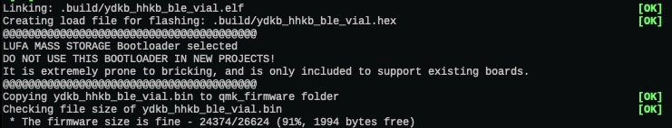

# Quantum Mechanical Keyboard Firmware

This is a keyboard firmware based on the [tmk\_keyboard firmware](https://github.com/tmk/tmk_keyboard) with some useful features for Atmel AVR and ARM controllers, and more specifically, the [OLKB product line](https://olkb.com), the [ErgoDox EZ](https://ergodox-ez.com) keyboard, and the [Clueboard product line](https://clueboard.co).

## Documentation

* [See the official documentation on docs.qmk.fm](https://docs.qmk.fm)

The docs are powered by [Docsify](https://docsify.js.org/) and hosted on [GitHub](/docs/). They are also viewable offline; see [Previewing the Documentation](https://docs.qmk.fm/#/contributing?id=previewing-the-documentation) for more details.

You can request changes by making a fork and opening a [pull request](https://github.com/qmk/qmk_firmware/pulls), or by clicking the "Edit this page" link at the bottom of any page.

## Supported Keyboards

* [Planck](/keyboards/planck/)
* [Preonic](/keyboards/preonic/)
* [ErgoDox EZ](/keyboards/ergodox_ez/)
* [Clueboard](/keyboards/clueboard/)
* [Cluepad](/keyboards/clueboard/17/)
* [Atreus](/keyboards/atreus/)

The project also includes community support for [lots of other keyboards](/keyboards/).

## Maintainers

QMK is developed and maintained by Jack Humbert of OLKB with contributions from the community, and of course, [Hasu](https://github.com/tmk). The OLKB product firmwares are maintained by [Jack Humbert](https://github.com/jackhumbert), the Ergodox EZ by [ZSA Technology Labs](https://github.com/zsa), the Clueboard by [Zach White](https://github.com/skullydazed), and the Atreus by [Phil Hagelberg](https://github.com/technomancy).

## Official Website

[qmk.fm](https://qmk.fm) is the official website of QMK, where you can find links to this page, the documentation, and the keyboards supported by QMK.

# FOR HHKB_BLE

以下是关于 YDKB 固件的说明，修改的位置在 [ydkb/hhkb_ble](https://github.com/kimiazhu/vial-hhkb-ble/tree/ava/keyboards/ydkb/hhkb_ble/)，为了限制空间大小，关闭了一些不用的功能，比如奇怪的 combo，mouse 支持等。因为调整了很多组合键，由于原有的GUI 配置工具无法很好支持部分组合键，尤其是 windows 下的 Win 组合键（因为 windows 上这个 GUI 修饰键会有实际作用，不像 mac 上那样），修改了 keymap.c 用于屏蔽不让修饰键在按下的时候就发送给操作系统，从而完美实现各种组合键。

PS:  20250420 增加一条判断，如果当前键盘处于layer 0，则 lctrl 和 lshift 会在按下是发送给操作系统，因为这两个按键在 win 和 mac 下独立的按下状态都有实际意义（多选或右击）。

## 编译用的镜像

`podman pull ghcr.io/kimiazhu/dev-qmk:250412`

也可以选择自己构建，参考：`https://github.com/web3123/dev-containers/tree/main/dev-qmk`，这个镜像内置了 SSH，用户名 root，默认密码为 abc@123456

## 运行编译容器

`pm run -d --user root --cap-add=NET_RAW -v ~/Development:/root/Development -p8890:22  ghcr.io/kimiazhu/dev-qmk:250412`

## 构建固件

通过 ssh 进入容器：`ssh -p 8890 root@localhost`，进入 `/root/Development` 目录，然后 `git clone --recursive git@github.com:kimiazhu/vial-hhkb-ble.git` 本工程，在工程根目录下执行：

`make ydkb/hhkb_ble:vial`

最后会得到大概如下的输出，表示编译成功：

## 刷写固件

- Windows 下按住 ESC 插入数据线，系统会挂载新的磁盘分区，将固件更名为 `HHKB_BLE.BIN` （大小写无关）然后copy 进分区中覆盖原文件即可刷入
- macOS 下按住 ESC 插入数据线，然后：
  - 通过`diskutil list` 确认键盘是在哪个分区
  - 使用 `diskutil umount /Volumes/HHKB_BLE` 先卸载键盘，
  - 使用 `sudo dd if=/path/to/vial-hhkb-ble/ydkb_hhkb_ble_vial.bin of=/dev/diskX seek=4` 刷写固件

## 快捷键列表
键盘设置了四层，层号0~3，0 层为默认层，一层为多功能层，通过 FN 按下时激活，内容根 HHKB 默认一样没有变。2 层为 Windows 层，3 层为 Mac 层。其中 1-2-3 层也可以通过 `右Alt`+1/2/3 数字键长期激活，短按 `右Alt` 也会回到 0 层。

|平台        | 按键        | 映射按键      | 含义                    |
|:-----------|:------------|:--------------|:----------------------|
|BOTH        | LCTRL-H     | LEFT          |方向左                  | 
|BOTH        | LCTRL-J     | DOWN          |方向下                  | 
|BOTH        | LCTRL-K     | UP            |方向上                  | 
|BOTH        | LCTRL-L     | RIGHT         |方向右                  | 
|BOTH        | LALT-H      | LCTL-LEFT     |向左一个单词             | 
|BOTH        | LALTL-L     | LCTL-RIGHT    |向右一个单词             | 
|BOTH        | LSHIFT-ESC  | ~             |波浪号                  | 
|BOTH        | LCTL-ESC    | \`            |反引号                  | 
|BOTH        | LSHIFT-Back | \|            |中竖线                  | 
|BOTH        | LCTL-Back   | \\            |反斜杠                  | 
|BOTH        | LCTRL-E     | END           |END                    | 
|BOTH        | LCTRL-"     | Backspace     |退格删除                |
|BOTH        | LCTRL-;     | Return        |回车                    | 
|BOTH        | LCTRL-B     | Backspace     |退格删除                | 
|BOTH        | LALT-ESC    | LALT-\`       |ALT-反引号，我主要用来激活 mac 下的 iterm      | 
|BOTH        | LALT-U      | Page UP       |上翻页                  |
|BOTH        | LALT-D      | Page DOWN     |下翻页                  |
|BOTH        | LALT-J      | Page UP       |上翻页                  |
|BOTH        | LALT-K      | Page DOWN     |下翻页                  |
|BOTH        | LCTL-D      | Delece        |删除当前字符            |
|macOS       | LCTL-R      | CMD-R         |浏览器刷新              | 
|Windows     | LWIN-A      | LCTL-A        |全选,保持跟 mac 相同     |
|Windows     | LCTRL-A     | HOME          |行首，mac下本来就是这个  | 
|Windows     | LCTRL-Q     | LALT-F4       |关闭当前应用程序         |
|Windows     | LCTRL-N     | F2            |重命名当前文件           |
|Windows     | LWIN-C      | LCTL-C        |复制                    |
|Windows     | LWIN-V      | LCTL-V        |粘贴                    |
|Windows     | LWIN-X      | LCTL-X        |剪切                    |
|Windows     | LWIN-F      | LCTL-F        |查找                    |
|Windows     | LWIN-S      | LCTL-S        |保存                    |
|Windows     | LWIN-W      | LCTL-W        |关闭tab                 |
|Windows     | LWIN-Y      | LCTL-Y        |Redo                    |
|Windows     | LWIN-Z      | LCTL-Z        |Undo                    |
|Windows     | LCTL-LSFT-L | LSFT-END      |全选到文末/行末          |
|Windows     | LCTL-LSFT-H | LSFT-HOME     |全选到起始/行首          |
|Windows     | LCTL-LSFT-J | LSFT-DOWN     |选择到下一行             |
|Windows     | LCTL-LSFT-K | LSFT-UP       |选择到上一行             |
|Windows     | LCTL-LSFT-B | LSFT-LEFT     |往左多选择一个字符        |
|Windows     | LCTL-LSFT-F | LSFT-RIGHT    |往右多选择一个字符        |
|Windows     | LWIN-L      | LCTL-L        |跳转到地址栏             |
|Windows     | LWIN-U      | LCTL-Z        |Undo                    |
|Windows     | LWIN-/      | LCTL-/        |注释代码                 |
